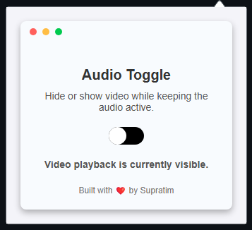

# YouTube Audio Toggle Extension 🎧🔊

## Backstory 📱📉

One day, while I was on mobile data and enjoying a YouTube video, I realized that I was only interested in the audio. The video stream was consuming unnecessary bandwidth and data. I thought to myself, "Why should I waste mobile data on something I don't need?" The idea hit me: *What if I could just listen to the audio and hide the video, saving data and improving my experience?*

That was the moment I decided to create this extension. The **YouTube Audio Toggle** extension allows you to hide the video on YouTube (and YouTube Music) while keeping the audio playing. Whether you're on mobile data, want to focus solely on the audio, or just prefer a minimalistic experience, this extension gives you full control. 🎶💡

## Features 🌟

- **Toggle Video Visibility**: Toggle the visibility of the video element while continuing to play the audio. ✅👀
- **Save Bandwidth**: Especially useful when you want to listen to music or podcasts on YouTube but don’t need the video. 🌐💾📉
- **Minimalistic Interface**: A simple and clean interface that helps you focus on the audio without unnecessary distractions. 🎧🖥️
- **Effortless Audio Experience**: Enjoy music, podcasts, and more without video distractions. 🖤🎧

## How It Works 🛠️

The extension works by detecting the video elements on YouTube or YouTube Music. When you click the toggle, the extension hides the video element while the audio continues to play. This allows you to **save bandwidth** while still enjoying your content. 🖥️🎶💡

### Steps to Use:

1. **Install the Extension**: Add the extension to your browser. 📥
2. **Navigate to YouTube or YouTube Music**: Open a video you wish to watch or listen to. 🎥➡️🎧
3. **Toggle Video Visibility**: Click the extension icon and use the toggle button to hide or show the video. 🔘
4. **Enjoy**: Continue listening to the audio without using additional data for the video! 🎶📱💾

## Installation 🚀

### Manual Installation:

1. Clone or download the repository to your local machine. 💻
2. Open your browser and go to the extensions page. 🌐
   - For Chrome, go to `chrome://extensions/`. 🔍
   - For Firefox, go to `about:addons`. 🦊
3. Enable **Developer Mode** (for Chrome) or **Debugging Mode** (for Firefox). ⚙️
4. Click on **Load Unpacked** (Chrome) or **Load Temporary Add-on** (Firefox). ⬇️
5. Select the folder where you cloned/downloaded the extension. 📂
6. The extension should now appear in your browser. 🌟

### From the Chrome Web Store:

If this extension is published on the Chrome Web Store, you can search for "YouTube Audio Toggle" and click **Add to Chrome**. 🛒

## Screenshots 📸

Here is a preview of how the extension looks in action:

  
*Example screenshot showing the extension in action on YouTube.*

## Technologies Used 🧰

- **HTML5**: For the structure of the popup. 📝
- **CSS3**: For styling the popup and overlay. 🎨
- **JavaScript**: For handling the core logic of toggling the video visibility and overlay effects. ⚡
- **Chrome Extensions API**: To interact with browser tabs and manipulate the DOM of YouTube. 🌍

## Contributing 🤝

If you'd like to contribute to this project, feel free to fork the repository, submit issues, or send pull requests. Contributions can be in the form of bug fixes, new features, or improvements in the code. ✨

### Guidelines:

- Follow the existing coding style and conventions. 🖋️
- Include tests if applicable. 🧪
- Keep commit messages concise and descriptive. 📑

## License 📝

This project is licensed under the MIT License - see the [LICENSE](LICENSE) file for details. 📜

## Contact 📬

Built with ❤️ by [Supratim Mondal](https://github.com/SupratimRK). 💻
